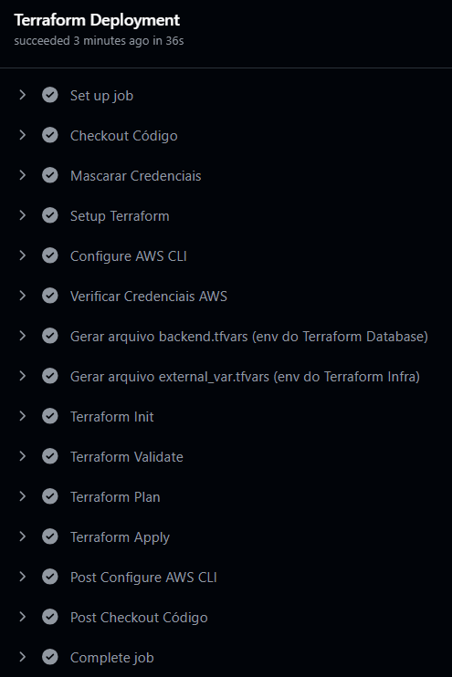

# Repositório dedicado para Recursos Serverless
- Inclui a estrutura de API Gateway
- Infraestrutura como código (IaC) com Terraform
- Utiliza Github Actions para CI/CD
- Documentação e guias de implementação
- Criação de recursos de IAM, como roles, policies, etc.

## Estrutura do Diretório

```plaintext
docs                        - documentações e guias de implementação
src                         - diretório principal com arquivos .tf
└── terraform
    ├── backend.tfvars      - configuração do backend do Terraform
    ├── external_var.tfvars - configuração dos recursos Serverless
    └── *.tf                - arquivos de configuração do Terraform
```

## Configuração do CI/CD

O repositório possui um workflow de CI/CD configurado com o Github Actions, que realiza a validação e deploy do RDS na AWS.

### CI - Continuous Integration

O workflow de CI é acionado a cada push no repositório, e executa as seguintes etapas:

[As ultimas execuções do CI podem ser visualizadas nesse link](https://github.com/pos-tech-soat08-03/easyOrder-challenge4-serverless/actions/workflows/terraform-ci.yml)


### CD - Continuous Deployment

O workflow de CD é acionado manualmente, e executa as seguintes etapas:

[As ultimas execuções do CD podem ser visualizadas nesse link](https://github.com/pos-tech-soat08-03/easyOrder-challenge4-serverless/actions/workflows/terraform-cd.yml)



## Subindo os recursos Serverless com o Github Actions (Produção)

Para subir os recursos Serverless com o Github Actions, siga os passos abaixo:

1. Acesse o repositório do Github e clique na aba `Actions`, ou acesse diretamente o link abaixo:
https://github.com/pos-tech-soat08-03/easyOrder-challenge4-serverless/actions

2. Clique no workflow `Terraform CD - Deploy Serverless` e em seguida clique no botão `Run workflow`

O workflow irá solicitar as chaves de acesso da AWS, que serão obtidas do ambiente do AWS Labs, e também o nome do bucket anteriormente criado no S3, que  armazena o estado do Terraform da Infraestrutura necessária para a subida dos Serviços:

```plaintext
aws_access_key_id: <AWS Access Key ID>
aws_secret_access_key: <AWS Secret Access Key>
aws_session_token: <AWS Session Token>
aws_account_id: <AWS Account ID>
aws_backend_bucket: <AWS S3 Bucket para armazenamento do estado do Terraform>
aws_region: <'AWS Region>
```

Ao final da execução do workflow, os recursos Serveless (API Gateway) serão criados na AWS, e o estado do Terraform com dados dos recursos serão armazenados no bucket S3 (mesmo utilizado na Infraestrutura e Aplicações).

## Subindo os recursos Serverless manualmente (Desenvolvimento)

Para subir os recursos Serverless (API Gateway, Cognito e Lambda) manualmente, siga os passos abaixo:

1. Garanta as credenciais da AWS já estejam configuradas no seu ambiente

``` bash
aws configure
```

2. Adicione o nome do bucket S3 (mesmo da Infraestrutura e Database) no arquivo `backend.tf` ao diretório `src/terraform` (embora utilizem o mesmo bucket, as chaves de acesso são diferentes):

``` hcl
bucket = "<adicione aqui o nome do bucket>"
key    = "easyorder-serverless/terraform.tfstate"
region = "us-east-1"
```

1. Adicione o nome do bucket S3 (mesmo da Infraestrutura e Database) e das credenciais de Banco arquivo `external_var.tfvars` ao diretório `src/terraform`:

``` hcl
bucket_infra = "<adicione aqui o nome do bucket>"
key_infra    = "easyorder-infra/terraform.tfstate"
region       = "us-east-1"
``` 

4. Execute os seguintes comandos, no diretório `src/terraform`:

``` bash
terraform init -backend-config="backend.tfvars"
``` 

``` bash
terraform plan -var-file=external_var.tfvars
``` 

``` bash
terraform apply -var-file=external_var.tfvars -auto-approve
``` 

Com essa sequência de comandos, os recursos Serverless serão criado, e o estado do Terraform será armazenado no bucket criado no S3. As informações essenciais também serão apresentadas no output do comando.

## Destruindo os recursos Serverless

Para destruir os recursos Serverless, execute o comando abaixo no diretório `src/terraform`:

``` bash
terraform destroy -var-file=external_var.tfvars
```

## Documentação

Para mais informações sobre a arquitetura, verifique o readme dos outros repositorios:

Infraestrutura: https://github.com/pos-tech-soat08-03/easyOrder-challenge4-infrastructure

Microserviços (aplicações):
- Cliente https://github.com/pos-tech-soat08-03/easyOrder-challenge4-app-cliente
- Produto https://github.com/pos-tech-soat08-03/easyOrder-challenge4-app-produto
- Core (Pedido, Pagamento e Preparação) https://github.com/pos-tech-soat08-03/easyOrder-challenge4-app-core
