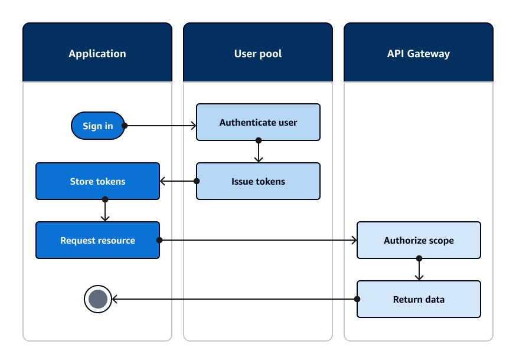

# Configuração de AWS Cognito - Administradores da Aplicação

## Referências de Documentação do Cognito

Documentação oficial AWS https://docs.aws.amazon.com/cognito/

- Documentação User Pools https://docs.aws.amazon.com/cognito/latest/developerguide/cognito-user-pools.html
- Referência API User Pools https://docs.aws.amazon.com/cognito-user-identity-pools/latest/APIReference/Welcome.html
- Comandos AWS CLI User Pools https://docs.aws.amazon.com/cli/latest/reference/cognito-idp/

- Treinamento AWS Cognito https://www.cognitobuilders.training/20-lab1/ 

Documentação Terraform Cognito https://registry.terraform.io/providers/hashicorp/aws/latest/docs/resources/cognito_user_pool

## Definições utilizadas no nosso Projeto (easyOrder)

Fluxo AWS


Fluxo Rascunho


Fluxo (adicionar) https://docs.aws.amazon.com/cognito/latest/developerguide/amazon-cognito-user-pools-authentication-flow.html

Dominio padrão utilizado http://easyorder-temp-domain.auth-east1.amazoncognito.com (de {customprefix}.auth-{region}.amazoncognito.com)

Uso de jwt - caso precise decodificar https://jwt.io/

## Configuração via AWS Console

...

## Configuração no Terraform

Terraform para testes está no diretório src/terraform/cognito

Para execução do terraform
``` bash
terraform plan 
terraform apply 
```