# Deploy de uma AWS Lambda com API Gateway

Este guia descreve como criar uma função Lambda na AWS e configurá-la para ser acessada via API Gateway. O objetivo é criar um endpoint público que retorne uma mensagem simples.

## Pré-requisitos

1. Uma conta na AWS (com permissões para criar recursos Lambda e API Gateway).
2. Acesso ao **AWS Management Console**.

---

## Passo a Passo

### 1. Criar a Função Lambda

1. Acesse o serviço `Lambda` no console da AWS:  
   [https://console.aws.amazon.com/lambda](https://console.aws.amazon.com/lambda)

2. Clique em `Create function` e configure:
   - **Author from scrath**: Deixe selecionado a primeira opção `Author from scratch` para termos um template básico padrão
   - **Function name**: `EasyOrder-Lambda-CPFValidation`
   - **Runtime**: Escolha uma linguagem como `Python 3.13` (ou mais atual).
   - **Architecture**: Selecionde `x86_64`

3. Clique em `Create Function`

4. Substitua o código gerado pelo exemplo abaixo:
    ```python
    def lambda_handler(event, context):
        return {
            'statusCode': 200,
            'body': 'Eu verifico se o CPF informado é válido.\nEstou online!'
        }
    ```

4. Clique em `Deploy` para salvar as alterações.

   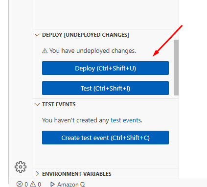

---

### 2. Configurar o API Gateway

1. Acesse o serviço `API Gateway` no console da AWS:  
   [https://console.aws.amazon.com/apigateway](https://console.aws.amazon.com/apigateway)

2. Se você ainda não tiver nenhuma API, clique em `Create API`

3. Escolha `REST API` e clique em `Build`

3. Selecione `New API` em `API Details`

3. Defina o nome da API:
   - **API Name**: `EasyOrder-ApiGateway-CPFValidation`

3. Clique em `Create API`

4. Agora na tela `Resources`, vamos criar um novo recurso:
   - Clique em `Create Resource`

      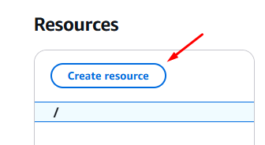

   - Marque `Configure as proxy resource`

      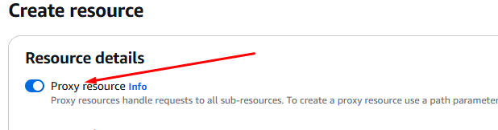

   - Garanta que `Resource path` esteja marcado como `/` e preencha `Resource name` com `{proxy+}`

      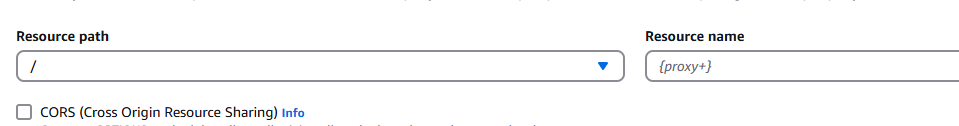

   - Clique em `Create Resource`

      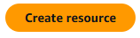

5. Configure o método HTTP:
   - Exclua o resource `ANY`, pois vamos criar um novo mais restrito

      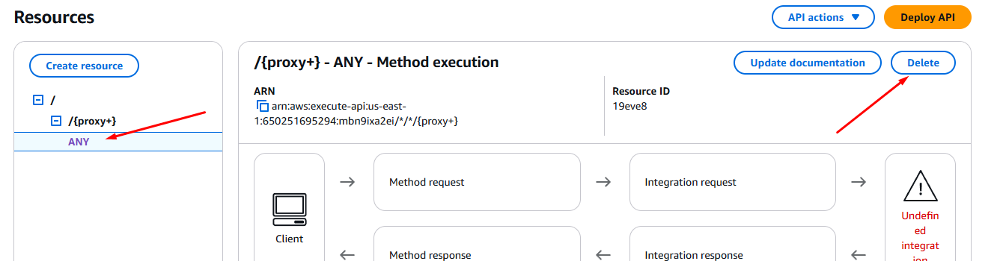

   - No recurso criado `/{proxy+}`, clique em `Create Method`

      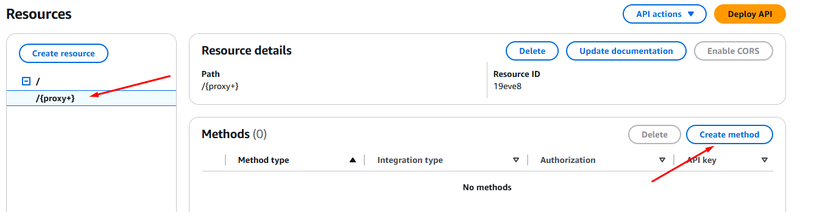

   - Na tela de criação do método, selecione `GET`

      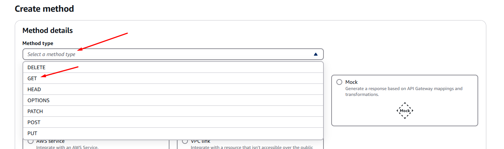

   - Em `Integration type`, selecione `Lambda Function`

      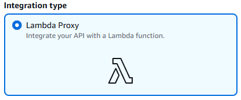

   - Em `Lambda function`, selecione a função lambda que criamos anteriormente pelo seu código `ARN`:

      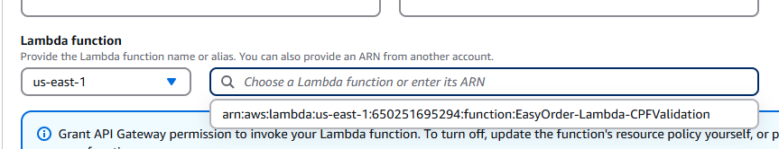

   - clique em `Create method`

      

6. Implante a API:

   Após configurar o método, você será redirecionado para a página dos `resources`

   - Selecione a sua rota no painel da esquerda e clique em `Deploy API`

      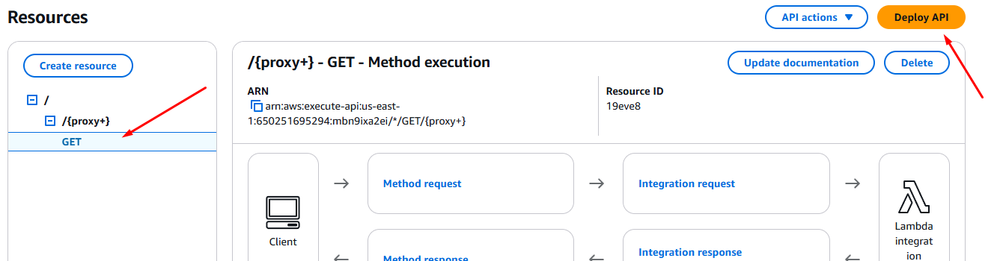

   - Escolha `[New Stage]`, nomeie como `PRDUCTION` por exemplo, e clique em `Deploy`

      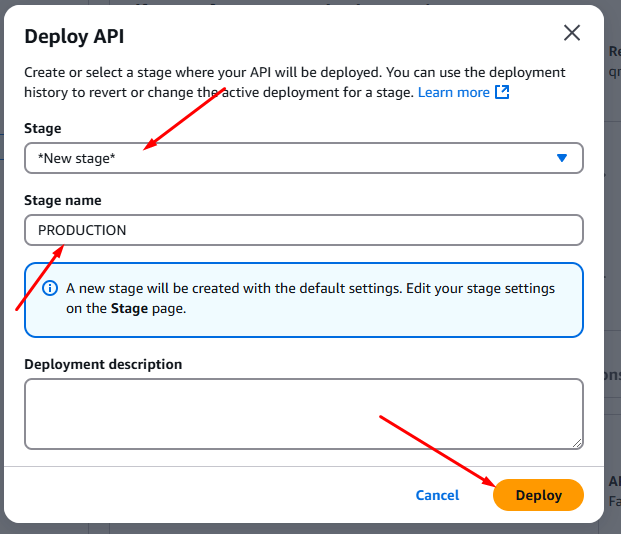

      *OBSERVAÇÃO: Ao fazer o deploy pode falhar, devido ao ANY não ter uma integração. Nesse caso, pode excluir o 
      

7. Copie a URL gerada, que será algo como:
   - https://xxxxxxx.execute-api.us-east-1.amazonaws.com/PRODUCTION

---

### 3. Testar o Endpoint

1. Faça uma requisição para o endpoint gerado:
- Acesse do seu navegador a url copiada + o nome do lambda:
  ```
  https://xxxxxxx.execute-api.us-east-1.amazonaws.com/PRODUCTION/EasyOrder-Lambda-CPFValidation
  ```

2. Você deve receber a resposta:

   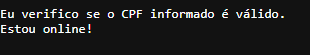